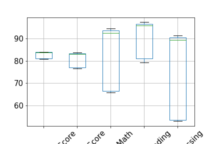
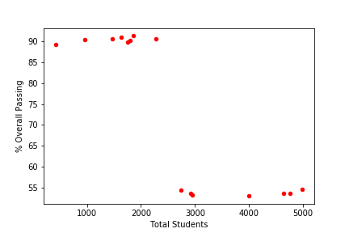
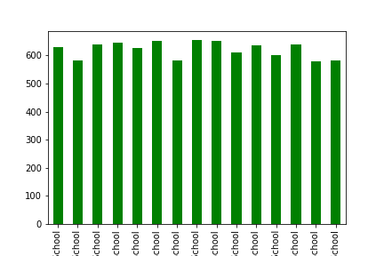

# School District Analysis
## Student success measured against budget constraints

### About
Analysis of student academic measurements vs. the budget and size of 15 schools that operate within a district. 

### Frameworks and Dependencies
Python Pandas
HTML

### File Structure
- There are two notebooks, one has scripts to clean the data, and the other is dedicated to analysis.
- Screenshots are in root folder, three of which appear below.
- A brief analysis is here: <a href='https://sherirosalia.github.io/School_Days/'>School Days</a>
- CSV file holds data and can be found in "Resources" folder.

### Visualizations

#### Top school student scores

#### School size vs. passing

#### Per capita spending

